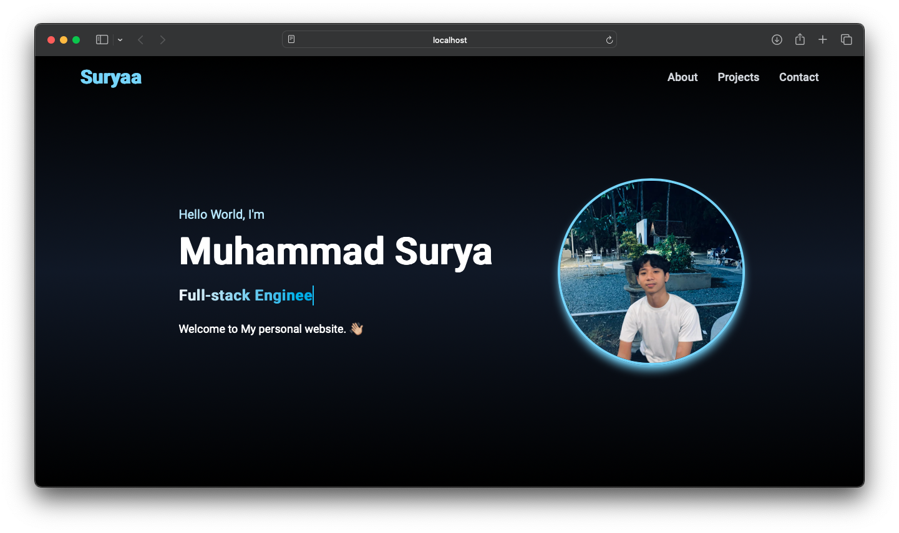

# Web Course Platform

Platform web interaktif yang dirancang untuk membantu mahasiswa memahami materi pemrograman secara mudah dan menyenangkan. Proyek ini menggunakan **Vite**, **React**, dan **Tailwind CSS** sebagai teknologi utama.

---

## ✨ Fitur
- **Interaktif**: Antarmuka yang user-friendly untuk membantu pembelajaran mahasiswa.
- **Responsif**: Dapat diakses melalui berbagai perangkat (desktop, tablet, dan ponsel).
- **Modular**: Struktur kode yang mudah dikembangkan dan dipelihara.

---

## 📸 Tampilan Proyek



> **Catatan:** Gambar di atas adalah antarmuka awal dari proyek ini. Bagian ini dapat diubah sesuai perkembangan proyek.

---

## 🚀 Teknologi yang Digunakan
- **Vite**: Build tool modern untuk pengembangan front-end.
- **React.js**: Library JavaScript untuk membangun UI yang dinamis.
- **Tailwind CSS**: Framework CSS yang utility-first untuk desain cepat.
- **PostCSS**: Untuk memproses CSS secara fleksibel.

---

## 📂 Struktur Proyek
Berikut adalah struktur direktori utama dalam proyek ini:

```plaintext
porto/
├── src/                # Source code utama
├── public/             # File statis
├── index.html          # Entry point aplikasi
├── tailwind.config.js  # Konfigurasi Tailwind CSS
├── postcss.config.js   # Konfigurasi PostCSS
├── package.json        # Dependencies proyek
└── vite.config.js      # Konfigurasi Vite
```

---

## 🔧 Cara Menjalankan Proyek Secara Lokal

1. **Clone repositori ini**:
   ```bash
   git clone https://github.com/LearnWithSuryaa/porto.git
   cd porto
   ```

2. **Install dependencies**:
   Pastikan Anda memiliki **Node.js** dan **npm** terinstal di sistem Anda.
   ```bash
   npm install
   ```

3. **Jalankan server pengembangan**:
   ```bash
   npm run dev
   ```
   Aplikasi akan berjalan di `http://localhost:5173`.

4. **Build untuk produksi**:
   ```bash
   npm run build
   ```
   Hasil build akan tersimpan di folder `dist/`.

---

## 🌐 Deployment

Proyek ini dapat dengan mudah dideploy menggunakan platform seperti **Vercel** atau **Netlify**. Langkah-langkah untuk deploy menggunakan Vercel:

1. Login ke [Vercel](https://vercel.com) dan buat akun.
2. Hubungkan repository GitHub Anda ke Vercel.
3. Pastikan konfigurasi build adalah:
   - **Build Command**: `vite build`
   - **Output Directory**: `dist`
4. Klik **Deploy**.

---

## 🤝 Kontribusi

Kami sangat menyambut kontribusi dari Anda. Silakan ikuti langkah berikut untuk berkontribusi:

1. Fork repository ini.
2. Buat branch baru untuk fitur/bug Anda:
   ```bash
   git checkout -b fitur-anda
   ```
3. Commit perubahan Anda:
   ```bash
   git commit -m "Menambahkan fitur baru"
   ```
4. Push ke branch Anda:
   ```bash
   git push origin fitur-anda
   ```
5. Buat pull request di GitHub.

---

## 📜 Lisensi
Proyek ini dilisensikan di bawah [MIT License](LICENSE).

---

## 📬 Kontak
Jika Anda memiliki pertanyaan atau saran, silakan hubungi saya melalui [GitHub Issues](https://github.com/LearnWithSuryaa/porto/issues).

---

Semoga proyek ini bermanfaat bagi semua mahasiswa! 🚀
